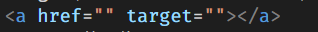
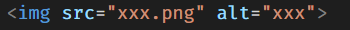
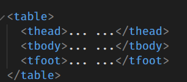
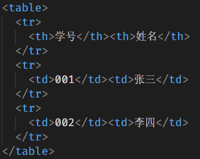

# 1. a 标签的用法：

作用跳转外部页面
它的属性有 href target download rel

- href 属性的值是#加上锚点名称。点击后，浏览器会自动滚动，停在当前页面里面“外部链接”锚点所在的位置
  
- target(可以指定在哪一个窗口打开)
  
  target 的取值
  1. \_self：当前窗口打开，这是默认值。
  2. \_blank：新窗口打开。
  3. \_parent：上层窗口打开
  4. \_top：顶层窗口打开。如果当前窗口就是顶层窗口，这个值等同于\_self。
  - download(代表当前的链接下载 不跳转另一个网站)
  * rel(说明了链接与当前页面的关系)
  - a 标签可以链接到 URL 网址 https://xxx.com
    http 当然不写 http 和 https 也可以 最后直接跳转到 https
    也可以链接绝对路径和相对路径，亦可以直接写文件名链接
    伪协议 javascript:;(冒号和分号中间写代码)
    创建一个不会跳转的链接
    mailto 是链接到邮箱 tel 是链接到手机号码

# 2.img 标签的用法

作用发出 get 请求插入一张图片
它的属性有 alt height weidth src

- alt 是图片的说明，图片下载失败时，浏览器会在图片位置，显示文字“xxx"
  

* height 和 width 可以指定图片显示时候的宽度和高度单位是像素或百分比
  

- src 就是图像的地址
  
  img 也可以做响应式 让网页变成手机页面 加上一句
  img{max-width：100%}

# 3.table 标签的用法

作用是弄出一个表格内容
有三个子元素 thead tbody tfoot 分别代表了表头，表体，表位

然后他们也有子集就是 tr(在一行内)th(表头)td(数据)

# 4.总结：还是依旧发懵 结合 MDN 文档去思考 很感谢给我点评的老哥也让我知道自己很多的不足
